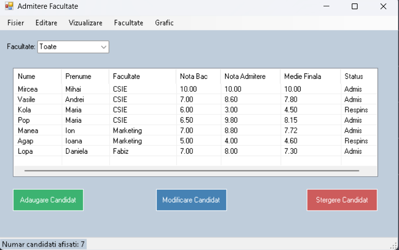
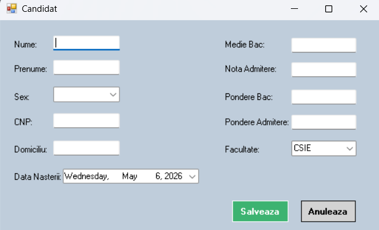
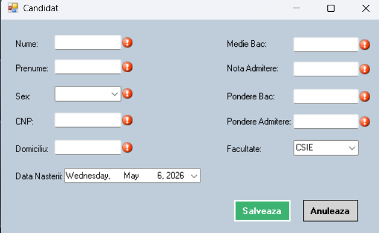
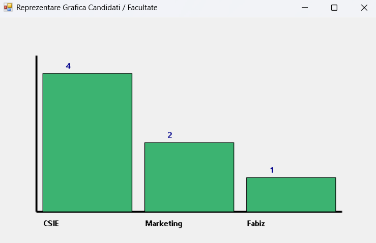
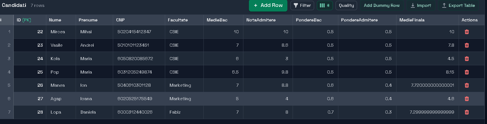
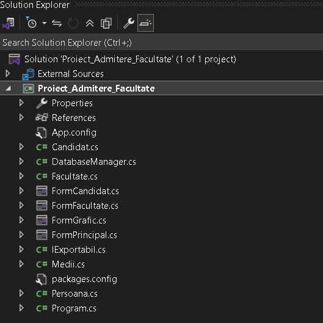
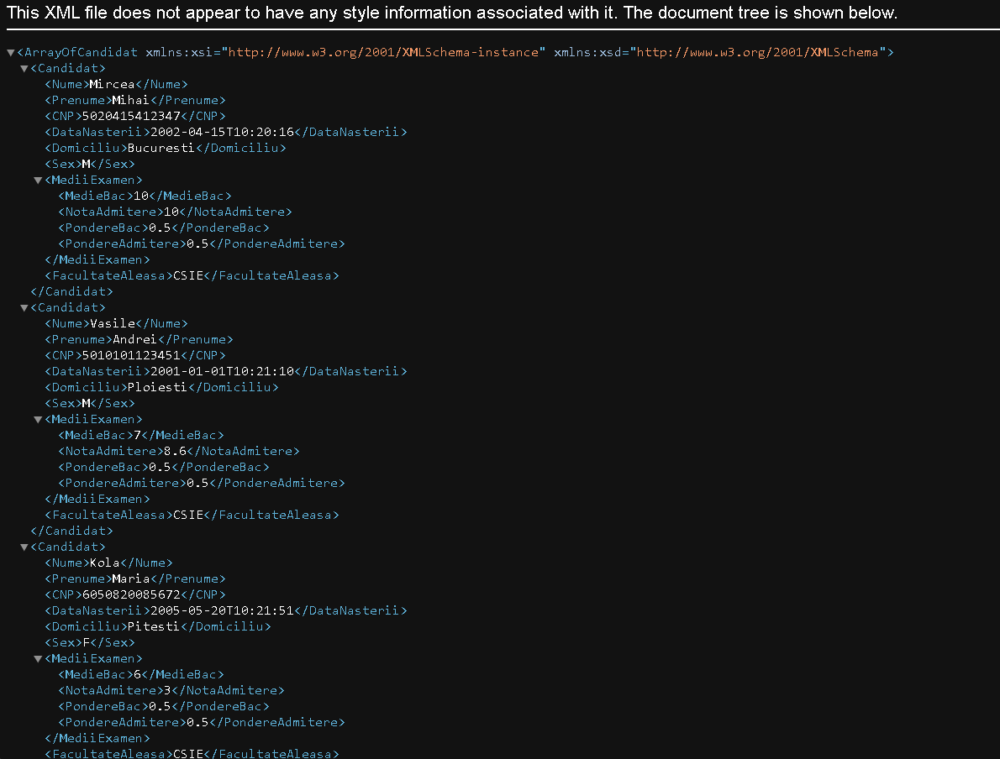
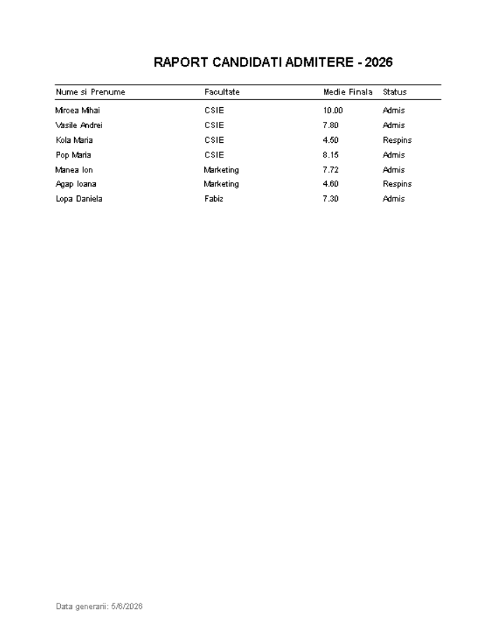

# 🎓 Admitere Facultate

Aplicație desktop dezvoltată în **C# / .NET Windows Forms** pentru
gestionarea procesului de admitere universitară.

Aplicația permite administrarea candidaților, calcularea automată a
mediei de admitere, persistența datelor în SQLite, import/export,
generarea de statistici și imprimarea rapoartelor.

## 🖥️ Preview

## ✨ Funcționalități

- CRUD complet pentru candidați
- Calcul automat al mediei de admitere
- Administrarea facultăților și a numărului de locuri
- Filtrare și sortare candidați
- Evidențiere vizuală Admis / Respins
- Persistență SQLite
- Import / Export TXT, XML și Binary
- Grafice generate cu GDI+
- Print Preview și imprimare cu paginare
- Validarea datelor cu ErrorProvider
- Data Binding

## 🧑‍🎓 Gestionarea candidaților

Candidații pot fi adăugați și modificați printr-un formular dedicat.

Datele introduse sunt validate înainte de salvare.

## 📊 Statistici

Aplicația poate genera un grafic cu distribuția candidaților
pe facultăți folosind GDI+.

## 🗄️ Baza de date

Datele sunt persistate într-o bază de date **SQLite**.

Operațiile CRUD folosesc query-uri parametrizate.

## 🏗️ Arhitectură OOP

Proiectul utilizează:

- clase abstracte și moștenire
- încapsulare
- `ICloneable`
- `IComparable`
- interfață proprie `IExportabil`
- operator overloading
- indexatori
- colecții generice

## 💾 Import / Export

Aplicația suportă:

- TXT
- XML
- Binary (`.dat`)
- SQLite

## 🖨️ Printing

Lista candidaților poate fi previzualizată și imprimată,
cu suport pentru paginare automată.

## 🛠️ Tehnologii

| Tehnologie | Utilizare |
|---|---|
| C# | Limbaj principal |
| .NET WinForms | Interfață desktop |
| SQLite | Persistența datelor |
| System.Drawing / GDI+ | Grafice |
| XmlSerializer | Serializare XML |
| Data Binding | Sincronizarea UI-model |

## 📚 Documentație

Documentația tehnică detaliată a proiectului se află în
folderul `Documentatie`.

## 🚀 Posibile îmbunătățiri

- sistem de autentificare
- hashing pentru parole
- operații asincrone cu `async/await`
- normalizarea bazei de date
- tabel separat pentru facultăți și relații Foreign Key---

## 👤 Autor

**Zinca Mihai Cristian**

Proiect realizat în cadrul disciplinei **Programarea Aplicațiilor Windows (PAW)**, utilizând **C# și .NET Windows Forms**.
